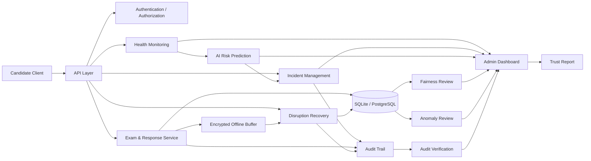

# ExamShield AI

## Resilient & Trustworthy Online Assessment Ecosystem

ExamShield AI is an AI-assisted resilience and trust layer for online examinations. It is designed to reduce disruption during digital assessments, detect operational risks early, support recovery, preserve response integrity, and generate evidence for post-exam trust and fairness review.

The project focuses on the full resilience lifecycle:

**Prevention → Detection → Response → Recovery → Trust**

---

## Problem Statement

Large-scale online and computer-based examinations can be affected by:

- network failures
- infrastructure degradation
- high server or database latency
- candidate session interruptions
- data inconsistencies
- operational incidents
- suspicious response or behavior patterns
- incomplete synchronization after disruptions

ExamShield AI addresses these risks through a centralized monitoring, prediction, recovery, audit, and review architecture.

---

## Core Features

### 1. Real-Time Health Monitoring

Tracks operational telemetry such as:

- CPU utilization
- memory utilization
- disk utilization
- database latency
- active/open incidents
- candidate/session disruption signals

These signals provide the operational foundation for risk detection.

### 2. AI-Assisted Failure Prediction

ExamShield AI evaluates live or simulated telemetry and produces an explainable failure-risk prediction.

The prediction layer provides:

- failure probability
- risk level
- primary risk drivers
- telemetry evidence
- prediction history
- model information

The current implementation uses an explainable telemetry-weighted prototype rather than a trained production ML model.

### 3. Automated Incident Detection

Operational risk can create or update incidents with severity levels such as:

- LOW
- MEDIUM
- HIGH
- CRITICAL

Predictive incidents can also be synchronized with the incident system so administrators can investigate emerging risks.

### 4. Offline Candidate Response Recovery

During a network disruption, the candidate can continue answering questions without losing local progress.

The recovery flow:

1. Candidate loses network connectivity.
2. Responses continue to be captured locally.
3. Response data is encrypted before local storage.
4. Responses remain in a pending synchronization queue.
5. Connectivity is restored.
6. Pending responses are synchronized with the backend.
7. The session can continue without requiring the candidate to restart.

This is the hero demonstration flow of the project.

### 5. Tamper-Evident Audit Trail

Important system events are recorded in an audit trail using SHA-256 based hash chaining.

This provides evidence for:

- event sequence
- response integrity
- administrative actions
- incident lifecycle
- post-exam verification

The system also exposes an audit verification endpoint.

### 6. Suspicious Pattern Detection

Behavioral and response signals can be analyzed for unusual patterns.

The system is designed to support **human review**, rather than automatically making a cheating accusation from an anomaly signal.

### 7. Fairness & Disruption Review

The fairness layer helps examine how disruptions affected candidates and whether recovery actions or incidents need further review.

### 8. Post-Exam Trust Reporting

The Trust Report aggregates operational and integrity evidence into one review surface.

The report includes areas such as:

- operational status
- prediction summary
- anomaly review
- fairness summary
- response integrity
- audit integrity
- overall trust status

---

## Architecture



---

## Resilience Lifecycle

### Prevention

Monitor infrastructure and candidate-session health before failures become widespread.

### Detection

Identify abnormal telemetry, incidents, candidate disruptions, and suspicious patterns.

### Response

Classify incidents, assign severity, preserve evidence, and surface operational information to administrators.

### Recovery

Allow candidates to continue during temporary connectivity failures and synchronize pending responses after reconnection.

### Trust

Provide audit verification, fairness review, response-integrity evidence, and a consolidated post-exam trust report.

---

## Hero Demo

The main demonstration shows how ExamShield AI handles a network disruption.

### Demo Flow

1. Login as the demo candidate.
2. Start the assessment experience.
3. Click **SIMULATE NETWORK FAILURE**.
4. The system registers a disruption and creates a tracked incident.
5. Continue answering questions while offline.
6. Responses are encrypted and stored locally in the pending queue.
7. Click **RECONNECT & SYNC**.
8. Pending responses are synchronized with the backend.
9. Review the recovered session and incident evidence.
10. Switch to the admin dashboard.
11. Review prediction, incident, audit, fairness, and trust-report evidence.

The demo demonstrates the principle:

> **A temporary connectivity failure should not automatically become an examination failure.**

---

## Technology Stack

### Frontend

- React
- TypeScript
- Vite
- Axios
- Zustand
- Recharts
- Lucide React

### Backend

- Python
- FastAPI
- Pydantic
- SQLAlchemy
- SQLite
- JWT authentication
- WebSocket support
- Redis/Celery-compatible architecture

### Security & Integrity

- HTTPS-ready API design
- JWT-based authentication
- Role-Based Access Control (RBAC)
- Password hashing
- Request validation
- CORS controls
- AES-GCM encrypted local response buffering
- SHA-256 hashing
- Tamper-evident audit hash chain

### AI / Analytics

- Explainable telemetry-weighted risk scoring
- Prediction history
- Risk-driver analysis
- Anomaly review
- Fairness analysis
- Trust reporting

---

## User Roles

### Administrator

The administrator can access:

- system health
- incidents
- AI prediction
- anomaly review
- fairness review
- audit verification
- trust reports

### Candidate

The candidate can access the assessment workflow and disruption-recovery flow.

---

## API Overview

### Authentication

```text
POST /auth/login
GET  /auth/me
```

### Health Monitoring

```text
GET  /health/metrics
```

### Incidents

```text
GET  /incidents
```

### Prediction

```text
POST /prediction/forecast
GET  /prediction/history
GET  /prediction/model-info
```

### Candidate Disruption Recovery

```text
POST  /candidate-disruptions/network
PATCH /candidate-disruptions/network/{incident_id}/resolve
```

### Audit

```text
GET /audit/events
GET /audit/verify
```

### Fairness

```text
GET /fairness/summary
```

### Trust Report

```text
GET /reports/trust
```

> Exact response schemas and route availability are defined by the backend implementation.

---

## Local Development Setup

### Prerequisites

- Python 3.14
- Node.js
- npm
- Git

---

## Backend

Open PowerShell:

```powershell
cd "C:\Users\LENOVO\OneDrive\Desktop\ExamShield-AI\backend"
.\.venv\Scripts\Activate.ps1
uvicorn main:app --reload
```

Backend:

```text
http://127.0.0.1:8000
```

Swagger API documentation:

```text
http://127.0.0.1:8000/docs
```

---

## Frontend

Open another PowerShell window:

```powershell
cd "C:\Users\LENOVO\OneDrive\Desktop\ExamShield-AI\frontend"
npm run dev
```

Frontend:

```text
http://localhost:5173
```

---

## Demo Credentials

### Admin

```text
Username: admin
Password: Admin@123
```

### Candidate

```text
Username: candidate
Password: Candidate@123
```

These credentials are for the local demonstration environment only and must not be used for a production deployment.

---

## Security Design

ExamShield AI uses multiple layers to protect examination integrity:

### Authentication

JWT-based authentication protects protected API routes.

### Authorization

Role-Based Access Control separates administrator and candidate permissions.

### Local Response Protection

Offline candidate responses are encrypted before being stored in the browser.

### Integrity Verification

Response hashes and audit hash chaining provide tamper-evident evidence.

### Human Review

Anomaly detection is designed to support investigation instead of automatically declaring candidate misconduct.

---

## Trust & Evidence Model

The system is designed so that an examination disruption can be investigated using multiple evidence sources:

```text
Candidate Session
       │
       ├── Response Events
       ├── Connectivity Events
       ├── Incident Events
       ├── Health Metrics
       ├── AI Prediction Evidence
       └── Audit Events
                │
                ▼
        Trust Review Layer
                │
                ▼
        Post-Exam Trust Report
```

This makes operational decisions more traceable and easier to review after the examination.

---

## Project Structure

```text
ExamShield-AI/
│
├── backend/
│   ├── app/
│   │   ├── api/
│   │   ├── core/
│   │   ├── models/
│   │   └── ...
│   ├── main.py
│   ├── examshield.db
│   └── ...
│
├── frontend/
│   ├── src/
│   ├── package.json
│   └── ...
│
├── .gitignore
└── README.md
```

---

## Prototype Scope & Limitations

This project is a hackathon-ready prototype demonstrating the core resilience and trust architecture.

Current limitations include:

- SQLite is used for the local/demo environment; a production deployment should use PostgreSQL or another production-grade database.
- The current AI prediction layer is an explainable telemetry-weighted prototype and is not a trained production ML model.
- Prediction thresholds and probabilities require calibration using real examination infrastructure telemetry before operational use.
- The candidate disruption demonstration uses a demo candidate identity in the current prototype.
- Production deployment would require hardened secrets management, HTTPS, centralized observability, scalable queues, database replication, and formal disaster-recovery procedures.
- Fairness and anomaly outputs should be reviewed with domain-specific policies and human oversight before operational decisions.

---

## Future Production Expansion

A production deployment can extend the prototype with:

- PostgreSQL
- Redis
- distributed task queues
- Docker and container orchestration
- NGINX / API gateway
- Prometheus and Grafana
- centralized logging
- multi-region disaster recovery
- model training and calibration from real telemetry
- stronger device/session integrity controls
- automated evidence retention policies
- formal examination rescheduling workflows

---

## Why ExamShield AI

Traditional online assessment systems often focus primarily on delivering questions and collecting answers.

ExamShield AI adds a resilience and trust layer around the examination lifecycle:

```text
Monitor
   ↓
Predict
   ↓
Detect
   ↓
Respond
   ↓
Recover
   ↓
Verify
   ↓
Trust
```

The goal is to make digital assessments more resilient to disruption while preserving reliable evidence for candidates, administrators, and post-exam review.

---

## Project Status

**Hackathon MVP — Demo Ready**

Implemented areas include:

- authentication and RBAC
- examination response workflow
- simulated network disruption
- encrypted offline response buffering
- response synchronization
- incident tracking
- AI-assisted failure-risk prediction
- anomaly review
- fairness review
- SHA-256 audit integrity verification
- post-exam trust reporting
- admin dashboard

---

## Repository

GitHub:

https://github.com/rudranshawadhiya193/ExamShield-AI
